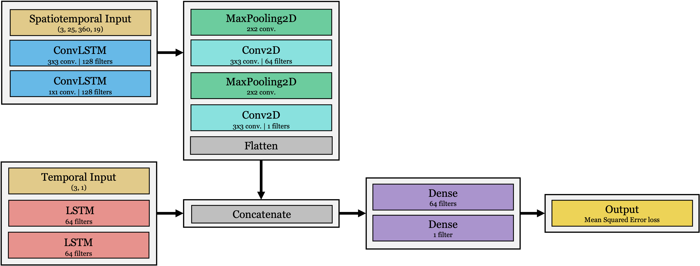

# Sea Ice Extent Forecasting using Convolutional LSTMs
<!-- Term project for SYDE 675: Sea ice extent forecasting using LSTMs, attention, and multiple timeframes -->

## Abstract
Arctic sea ice is important for the Earth’s climate and ecosystem. The rapidly changing climate is making it more difficult to predict annual fluctuations in Arctic sea ice extent. In this paper, a data-driven approach is taken to predict monthly Arctic sea ice extent using deep learning. We first assess the work of (Ali et al., 2022) in their paper "Sea Ice Forecasting using Attention-based Ensemble LSTM" and find a lack of reproducibility in their methodology, and note that naive statistical baselines outperform their proposed model. We then propose an alternative model architecture which accepts both spatial and temporal inputs, and uses several new climatic input variables. We test a variety of hyperparameters and find our best model achieving a %RMSE of 4.88% and MAPE of 3.29%, outperforming a climatology with linear trend baseline by 56% in %RMSE.

## Project Navigation
This project consists of 1) replicating Ali et al.'s original results, 2) enhancing their architecture using their data, 3) evaluate traditional ML methods on the original dataset, and 4) proposing and evaluating a novel model architecture using new data. Work done to fulfill (1) and (2) can be found in folders named 'Replication', (3) can be found in 'ML_Models', and (4) can be found in 'Improvements'.

The final scores of our proposed models are in Results/Improvements/all_results.csv, and visualizations can be found under Models/Improvements/evaluation.ipynb.

## Folder Structure
```
.
├── Data
│   ├── Arctic_domain_mean_1979_2018.csv             ┐
│   ├── Arctic_domain_mean_monthly_1979_2018.csv     │
│   ├── dailyt30_features.npy                        │- Original data from Ali et al.  
│   ├── dailyt30_target.npy                          │ 
│   ├── monthly_features.npy                         │
│   ├── monthly_target.npy                           ┘ 
│   └── extents.nc  <-- SIE calculated from ERA5 SIC estimates
├── Models
│   ├── Improvements
│   │   ├── model.py  <-- Contains the main model class 
│   │   ├── pre-process.ipynb  <-- Pre-processing the spatial data & calculating SIE
│   │   ├── run_tests.ipynb  <-- Train models given a set of hyperparameters
│   │   ├── evaluation.ipynb  <-- Model evaluation and visualization
│   │   └── xgrid_utils.py  <-- Used to calcualte SIE
│   ├── ML_Models
│   │   └── ML_models.ipynb
│   └── Replication
│       ├── d-LSTM_Replication.ipynb  <-- Replicating the daily-to-monthly model results 
│       ├── m-LSTM_Replication.ipynb  <-- Replicating the monthly-to-monthly model results
│       ├── E-LSTM_Replication.ipynb  <-- Replicating the ensemble model results
│       ├── EA-LSTM_Replication.ipynb  <-- Replicating the attention-based ensemble model results
│       ├── EA-LSTM_Enhanced.ipynb  <-- Enhancing the original architecture 
│       └── EA-LSTM_Enhanced_Separated.ipynb  <-- Training each model separately 
└── Results
    ├── Improvements
    │   ├── all_results.csv  <-- Results of all experiments
    │   └── sensitivity_analysis.csv  <-- Results of the sensitivity analysis 
    ├── ML_Models  <-- CSV files containing scores for each ML model
    │   └── ...
    └── Replication  <-- Results of running the original models 20 times
        ├── d-lstm_scores.csv
        ├── ea_lstm_scores.csv
        ├── e_lstm_scores.csv
        └── m-lstm_scores.csv
```

## General Model Architecture
Our proposed model architecture consists of stacked ConvLSTM, convolutional/pooling layers, and LSTM layers.


## Best Model Architecture


## References
> Ali, S., Huang, Y., Huang, X., and Wang, J. Sea Ice
Forecasting using Attention-based Ensemble LSTM.
arXiv:2108.00853 [physics], February 2022. URL
http://arxiv.org/abs/2108.00853. arXiv:
2108.00853.
